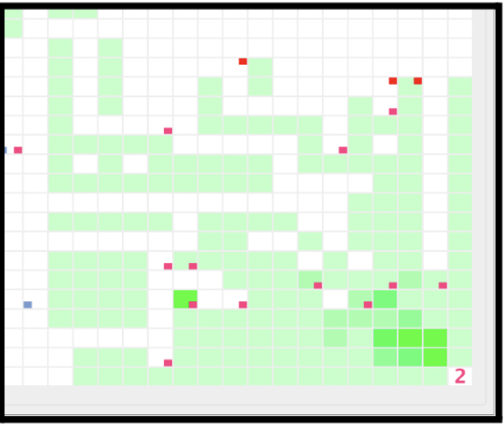
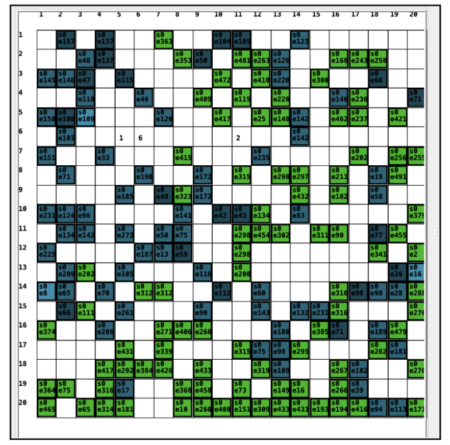
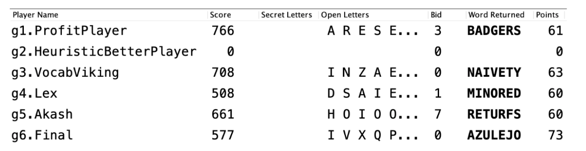
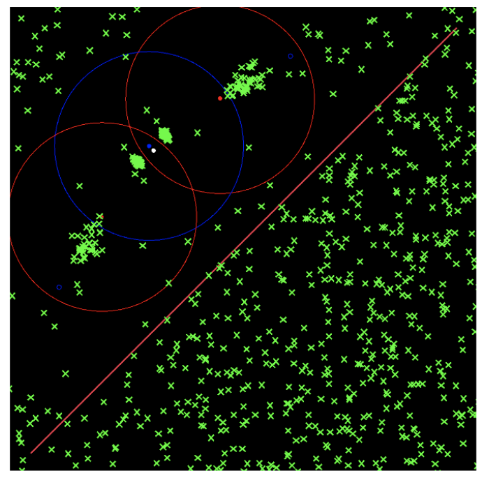

The aim of the projects was to iteratively build on algorithmic strategies and performance optimisations to submit a "player" for each game by periodically testing your strategies against other teams.

The 4 projects involved as a part of this are:
1. Parallel Football
2. Organisms
3. Seven
4. Mosquito

These projects are a part of the course CIS 5590: Programming and Problem Solving (Fall 2023), University of Pennsylvania. Code for these projects cannot be uploaded to GitHub to adhere to course policies that prevent publishing code to adhere with the academic integrity requirements. Please reach out to me for questions regarding implementation details.

## 1. Parallel Football

Parallel Football is a team game, played on a 32x32 grid by four teams. Each team has P players, each occupying a cell, and a home cell located at a corner of the grid. Each cell except for the home cells begins with a football, totaling 1020 footballs overall. The objective is to kick balls to the team's home cell. Teams designate their players' initial positions. Players can move one cell in any direction or kick a football within a K-cell range. Although cells may contain multiple balls, players can kick only one ball at a time. However, multiple players can kick simultaneously if enough balls are present. Scoring is achieved when a ball reaches a home cell, and the aim is to score as many goals as possible. To accomplish this, teams must strategically define their players' initial positions and movements.

## 2. Organisms

“Organisms” is a virtual ecosystem, manifested as a grid. Organisms on the grid rely on energy to survive, which they can obtain from eating food scattered across the grid. As these organisms move, reproduce, and interact with their environment, they adhere to specific rules and constraints. It is a game with imperfect information where each organism can only “see” in the four orthogonal directions, which gives them information about the presence of food and other organisms on a neighboring square. Each organism also has a number between 0 and 255 called its external state which is viewable by the organisms on the neighboring squares. The essence of this project is to observe, understand, and predict how these organisms will behave, adapt, and evolve over time in a world filled with opportunities and threat

There are multiple ways to define success in the context of this project. Our group’s goal was to create an adaptable, versatile brain that is able to survive in many different environments.

## 3. Seven

Seven, a Scrabble inspired game entails creating a player whose task is to bid on letters in an efficient manner to make high-scoring words. Players bid on letters from a common pool of 98 letters and aim to create high-scoring words, preferably creating words with a score higher than what the player spent to create that word. Starting from a score of 100, each player plays for n rounds with 8p bids per round where p is the number of players in the game. Each letter has a score attached to it which is directly proportional to how rare the letter is in the English language. Players can make up to 7 letter words with 7 letter words bagging them additional 50 points. Each game can also be played with 0 to 6 secret letters that are dealt to each player randomly at the start of every round. These secret letters are taken from the initial common pool of 96 letters itself. Each bid is submitted simultaneously and the winning bid has to pay the amount of the second-highest bid for the letter up for auction, following the rules of Vickrey auction. In a round, letters are auctioned without replacement. In the event of a tie, the simulator randomly selects a winner amongst the top bidders. Words are deemed valid by checking them against a list of 1 to 7 letter valid word lists and are awarded respective scores

The team created a player whose bidding strategy relied on a combination of trying to make 7 letter words by using the letters efficiently by determining the best ‘n’ future words we can make at every bidding round and a ‘memory’ heuristic which kept track of the previous winning and highest bids made for the letter over the rounds

## 4. Mosquito

Mosquito is a single player game with very simple gameplay. Before a game starts, the player gets access to the board’s layout, which includes a set of walls that are guaranteed not to completely partition the board. The player is also told how many lights they can place. The goal is to place these lights anywhere on the board so that they capture 50% randomly placed mosquitos as quickly as possible. The player can also place one collector, and when a mosquito flies over the collector, they are captured and removed from the board. The player must submit their placements before the game starts, and cannot edit them afterwards. 

The team developed a player called Itchy Infantry that has a greedy approach to Mosquito. Itchy Infantry simulates many rounds and returns the best simulated round’s lights and collector. Within the simulation, it places the first light and the collector in what it perceives as one of the most open spots, and has a greedy approach afterwards, placing lights in the position that covers the most open area.

