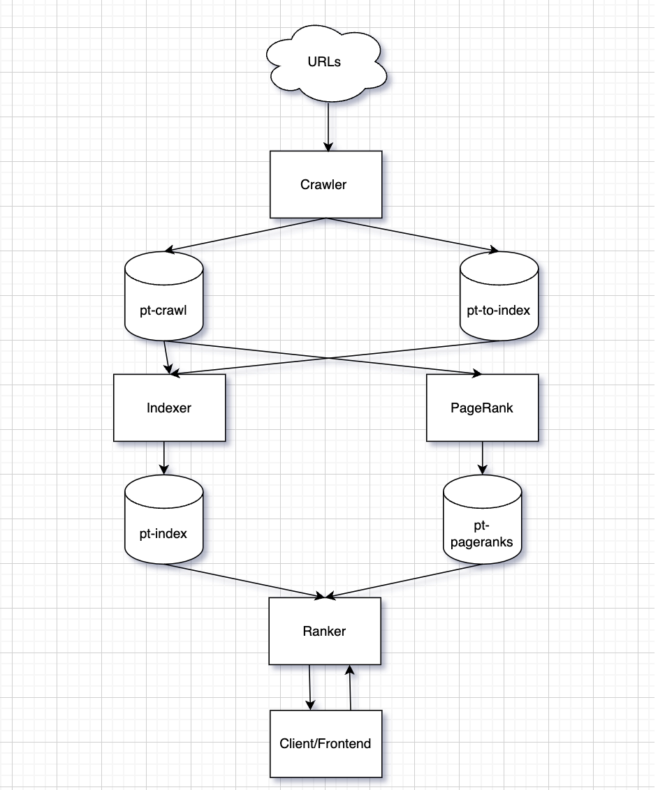

**Crawl and Order** is a scalable, cloud-based search engine. The system is designed to efficiently handle user queries
and deliver relevant search results. It consists of four major components:

1. **Crawler**: Crawls the web and fetches pages.  
2. **Indexer**: Builds an inverted index from the crawled pages.  
3. **PageRank**: Ranks pages based on their importance.  
4. **Ranker**: Queries the inverted index and the pagerank results to compute a final score for every relevant URL and order them in decreasing order of relevance.  
5. **Frontend**: Provides a user-friendly interface to perform web search and image search.  

Under the hood, the project is built on a scalable distributed Key-Value storage which exposes simple operations like GET, PUT and DELETE. Interaction with the KV store is through a distributed computational framework called Flame, which is similar in its functionality to Apache Spark.

One can submit a Job (such as crawler.jar) to the Flame Coordinator, which will then distribute the job to multiple Flame Workers. The workers will then fetch the data from the KV store (interacting with the KVS Coordinator and subsequently with relevant KVS Workers), process it according to the functions and lambdas specified by the submitted job and write the results back to the KV store. The KV store is also responsible for storing the intermediate results of the computation.

The most fundamental unit of computation of the Flame framework are FlameRDDs and FlamePairRDDs. The framework also exposes functions on these RDDs such as map, mapToPair, flatMap, flatMapToPair, foldByKey, filter, join, etc. which can be used to perform complex distributed computations.

Communication between the components is done using the HTTP protocol. All the components run a multithreaded HTTP webserver to process requests. The KV Store persists data in Protobuf format.

GitHub Repo: [Crawl-And-Order](https://github.com/sahilparekh08/Crawl-And-Order)

NOTE: This project was a part of the course CIS 5550: Internet and Web Systems (Fall 2024), University of Pennsylvanai