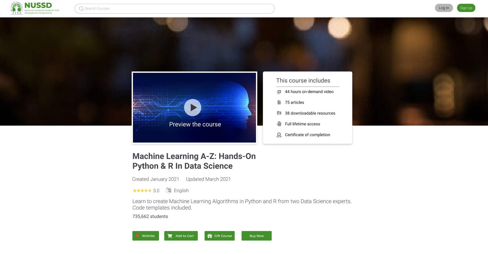
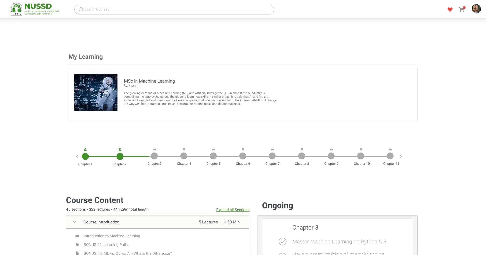
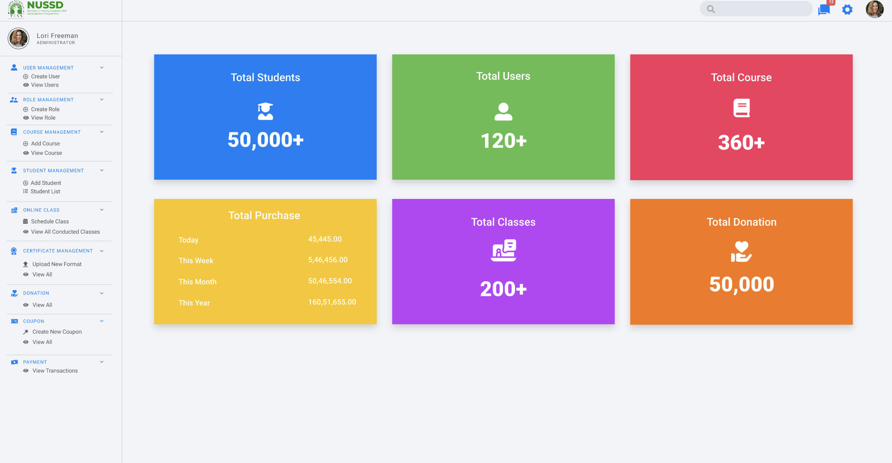

_Circa 2020_.

It was the middle of the Covid-19 global pandemic and among the worst hit in the education sector were underprivileged children in school. The goal was to make a cost-effective and easily manageable learning management system which could enable instructors and schools to impart education and students to learn from their houses. A small team comprising of junior (including me) and senior developers from JP Morgan Chase collaborated with Tata Institute of Social Sciences to create this system. It was deployed on an AWS infrastructure using DynamoDB and S3 as its storage components with the application written in ReactJS and NodeJS.

The application consisted of a student and instructor portal which were analogous to a customer and admin portal. Each school could have its own instructor portal, course management systems and grading systems. Students could register as a part of a school or as individuals to learn publicly available courses. The application was also made to be lightweight and consume low bandwidth especially during video streaming so as to perform well in poor network conditions.

I worked on the backend development, primarily on the API structure design, development, testing and connectivity to the front end. I also worked on designing the AWS infrastructure, configuring security policies and setting up S3 and DynamoDB after doing a cost analysis.

