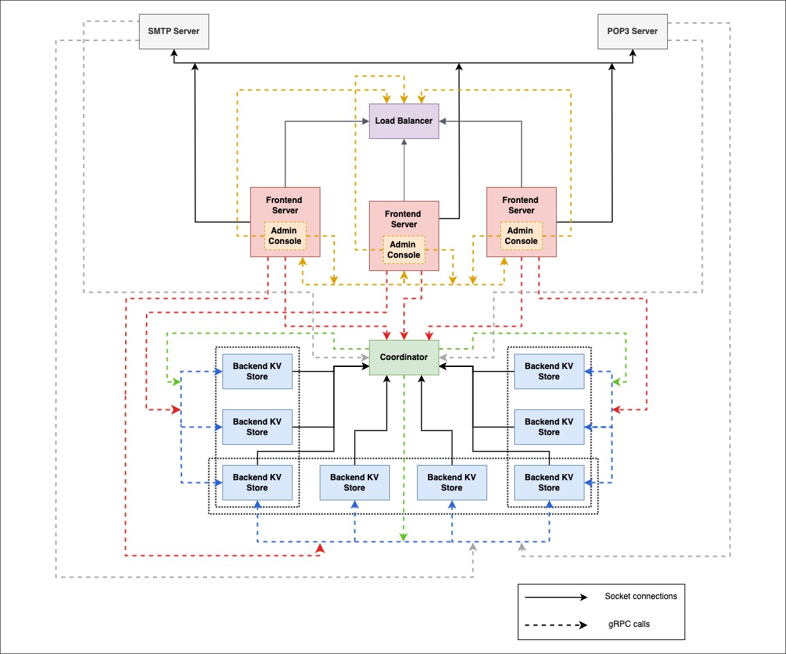

PennCloud exemplifies a distributed, scalable, and fault-tolerant system. It encompasses a frontend interface enabling users to send emails to PennCloud users and external users, store and retrieve files and manage related folders and work on collaborative spreadsheets. The system also offers user authentication and password management.

Key terms:
- Checkpointing
- Logging
- gRPC
- Dynamic membership of servers
- load rebalancing
- Causal Consistency 
- HTTP web server

The system accepts requests for any user on a static address which belongs to a load balancer. The load balancer then redirects the user to an active frontend server which accepts different kinds of HTTP requests. The load balancer keeps track of all active frontend servers, also providing the ability to scale the frontend layer. The user requests are redirected to a backend layer which comprises of stateless backend servers and a Key-Value store, ensuring durability, consistency and availability. Managed by a coordinator, the backend layer supports dynamic membership, allowing for the seamless integration of new backend servers.

The system also provides an admin console which shows information about the number of active and inactive frontend and backend servers, the partitions assigned to each backend servers and the ability to stop and restart frontend and backend servers to aid in scalability.

GitHub Repo: [PennCloud](https://github.com/sahilparekh08/PennCloud)

NOTE: This project was a part of the course CIS 5050: Software Systems (Spring 2024), University of Pennsylvanai
